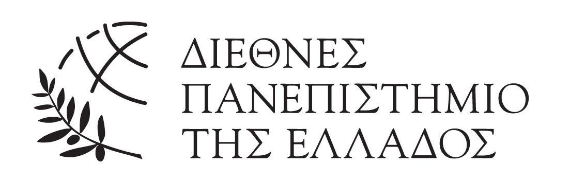

---

<h3 align="center">GG-Extraction-2022</h3>
NOTE: THIS REPO IS UNDER CONSTRUCTION SOME ATTRIBUTES MAY NOT BE FULLY FUNCTIONAL

## 📝 Table of Contents
- [Problem Definition](#problem_statement)
- [Setting up a local environment](#getting_started)
- [Usage](#usage)
- [Future Scope](#future_scope)
- [Contributing](../CONTRIBUTING.md)
- [Authors](#authors)
- [Acknowledgments](#acknowledgments)

## 🧐 Problem Definition <a name = "problem_statement"></a>
The administration of countries as well as the structure of the respective ministries are constantly changing. This fact, leads to redefinition of internal structure between Governmental Units and their responsibilities quite often. To manually extract the information and construct organization charts in parallel with responsibility assignments between ORgs is a time-consuming process. Based on that, this tool aims to automatically extract the RELATIONS and the RESPONSIBILITIES that a Public Administration Organization Presidential Decree may contain. 

## 🏁 Getting Started <a name = "getting_started"></a>

To install, simply git clone this .

Afterwards you need to install the . This can be done by:  
`pip install -r requirements_gg22.txt`

After setting all up, one can use command line to get the results that is interested in.  
All you have to do is to execute 
 by providing the filepath of the pdf file you wish to parse and the respective task and applied method.  
* The task can be either **RE** (relation-extraction) or **RSP** (responsibility assignment).  
* The method can be either **ML** (machine-learning) or **RB** (rule-based)  

## 🎈 Usage <a name="usage"></a>
You can directly test, using the files available on file .
For example one can simply execute:  
`python main.py --filepath fek-organismoi-upourgeiwn/yp-metanasteushskaiasulou-106-2020.pdf --task RE --method ML`  

The above command will create in your directory an rdf file with the results as well as a .png file.

In case you are interested in other subtasks you may execute the following:  

* Apply named-entity recognition on given legal text  

Based on Regex

```
from rbner.rbNER import rbNER  
rbner = rbNER()  
results = rbner.hybridNER(text)
```

* Get the articles given a txt file
```
from src.fek_parser FekParser
FPRS = FekParser(textpath)
articles = FPRS.articles
```

* Get the paragraphs given a txt file and a piece of text (normally an article)
```
from src.fek_parser FekParser
FPRS = FekParser(textpath)
paragraphs = FPRS.find_article_paragraphs(text)
```

* Scrape amendments from kodiko.gr (account required). For more information see . 
```
python amendments_detector.py --filepath https://www.kodiko.gr/nomothesia/document/308558 --email example@example.com --password --br firefox
```

## 🚀 Future Scope <a name = "future_scope"></a>

...add text

## ✍️ Authors <a name = "authors"></a>
- [@Ioannis Konstantinidis](https://github.com/ikonstas-ds)  
- [@Konstantinos Christantonis](https://github.com/konschri)
- [@Eleni Kapantai](https://github.com/ekapantai)
- [@Alexandros Michailidis](https://github.com/michailidisa)


See also the list of [contributors](https://github.com/dorg-ihu/gg-extraction-2022/graphs/contributors) 
who participated in this project.

## 🎉 Acknowledgments <a name = "acknowledgments"></a>
We are really grateful on the authors of the following tools:
- 
- 

on which we relied on ... +text
